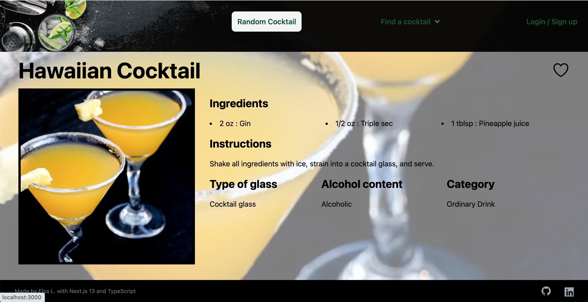
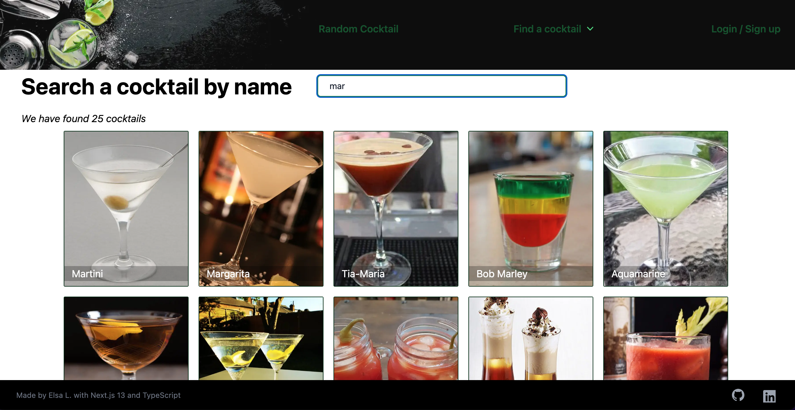
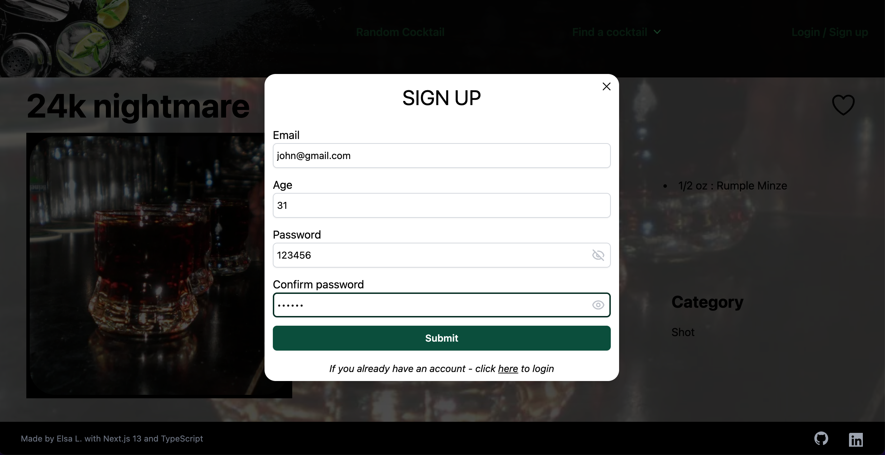
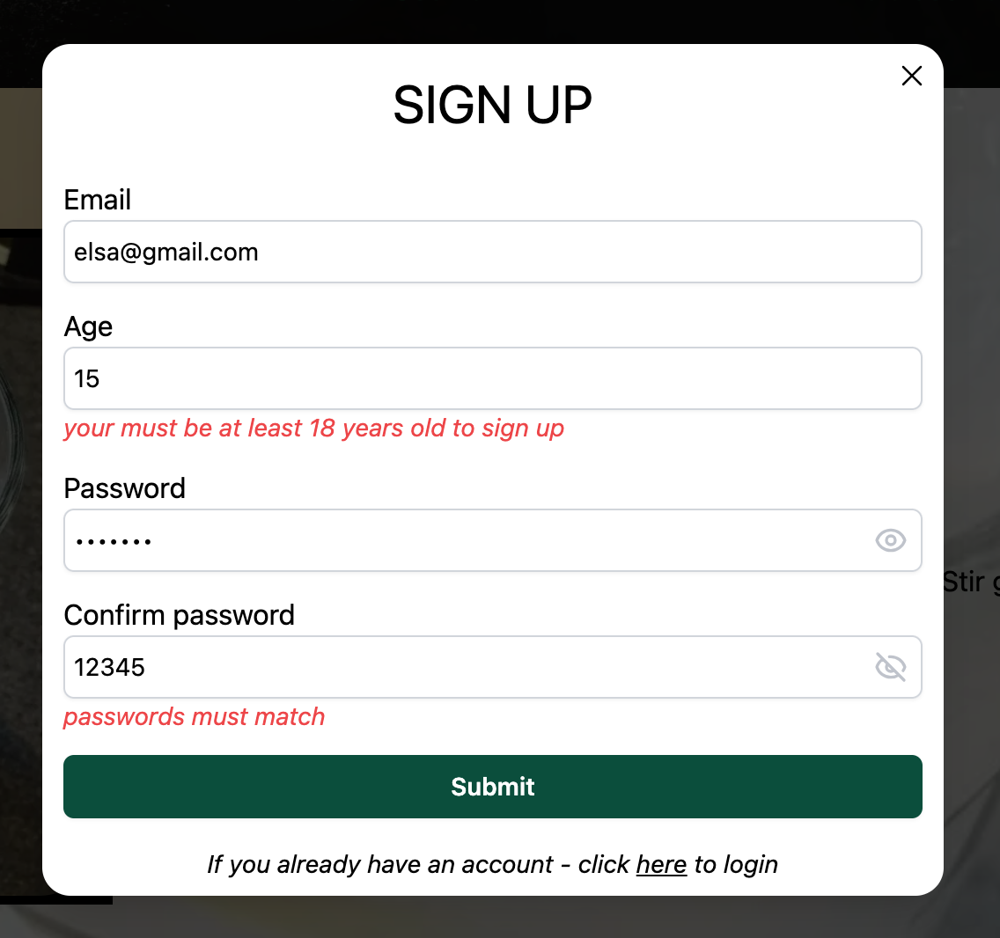
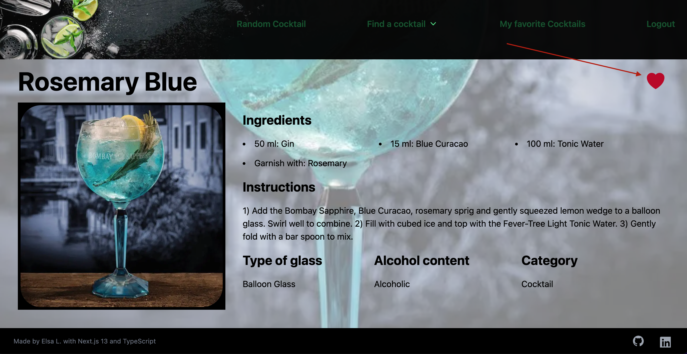
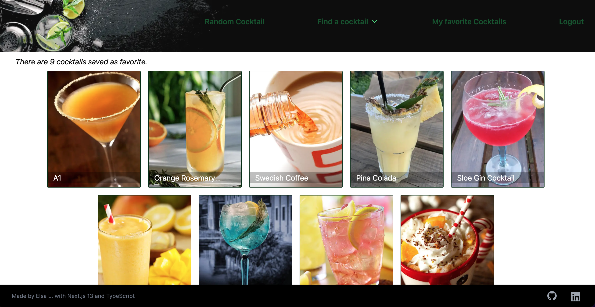

## SET UP 👨‍💻

```bash
yarn add
```

to install all the packages

```bash
yarn dev
```

open `http://localhost:3000` in your browser

## PROJECT 🍸 🥃 🍹


- Next.js 13

- uses the [API cocktaildb](https://www.thecocktaildb.com/api.php)

- offer a random cocktail suggestion



- search cocktails by name or ingredients



- create an account, login, logout with **React Hook Form** and **zod**




- if logged in, can save cocktails as favorite



- if logged in, can see all the cocktails saved as favorite


